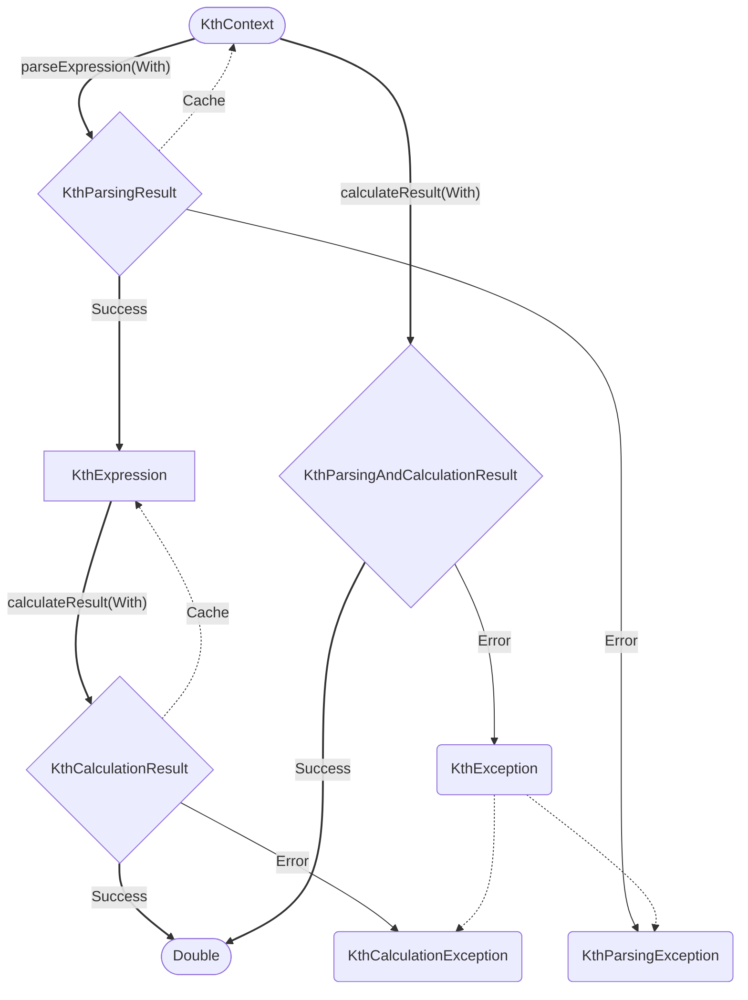

## Installation

The library is available on [Maven Central](https://search.maven.org/artifact/com.skyecodes.karith/karith).

=== "Gradle (Kotlin)"

    ```kotlin
    implementation("com.skyecodes.karith:karith:0.2.0")
    ```

=== "Gradle (Groovy)"

    ```groovy
    implementation 'com.skyecodes.karith:karith:0.2.0'
    ```

=== "Maven"

    ```xml
    <dependency>
        <groupId>com.skyecodes.karith</groupId>
        <artifactId>karith</artifactId>
        <version>0.2.0</version>
    </dependency>
    ```

## Simple example

```kotlin
println(calculateResult("1 + 2").orThrow()) // 3.0
println(calculateResultWith("3a + b", "a" to 1, "b" to 2).orThrow()) // 5.0
println("6 % 4".calculateResult().orThrow()) // 2.0
println("6 / min(x,y)".calculateResultWith("x" to 2, "y" to 3).orThrow()) // 3.0
```

## Contexts and modules

A [context](glossary.md#context) is an object that contains all the [operators](glossary.md#operator),
[functions](glossary.md#function) and [constants](glossary.md#constant) that you can use in
an [expression](glossary.md#expression).
It is the entry point of the library as it is required in order to parse an expression.
A context can include some [modules](glossary.md#module), operators, functions and constants in it.

You can easily create your own context using helper functions. Here is an example:

```kotlin
// creates a context with basic operators and functions:
// contains the same elements as the default context
val ctx = buildDefaultContext()

// creates a context with + and - operators only
val ctx = buildContext { withOperators(Operators.PLUS, Operators.MINUS) }
```

To see how to create your own operators, functions and constants, check the [Advanced](advanced.md) page.

!!! note "Default context"

    In the [Simple example](#simple-example), the methods `calculateResult`, `calculateResultWith`, `calculateResult` and `calculateResultWith` implicitly use a default context.
    This default context includes basic operators and math functions.
    It is appropriate to use it in most cases, unless you need to use your own custom operators or functions.

## Parsing an expression

You can parse an expression using the `parseExpression` or `parseExpressionWith` methods.
You can either pass the expression string as a paremeter or use it as receiver.

```kotlin
// As parameter
val expr = ctx.parseExpression("1 + 2")
val expr = ctx.parseExpressionWith("3a + b", "a", "b")

// As receiver
with(ctx) {
    val expr = "6 % 4".parseExpression()
    val expr = "6 / min(x,y)".parseExpressionWith("x", "y")
}
```

All of these methods return a `KthParsingResult`, which represents either a `KtxResult.Success` containing a
`KtxExpression`,
or a `KtxResult.Error` containing a `KthParsingException`.

When using `parseExpressionWith`, you can pass the name of the variables as arguments.
During parsing, if an unknown variable is found, a `KtxResult.Error` will be returned.
Variables that are passed as parameter but not used in the expression are ignored.

```kotlin
val exprError = ctx.parseExpressionWith("3a + b", "a")
// KtxResult.Error(KthIllegalTokenException): "b" was not declared as a variable

val exprIgnored = ctx.parseExpressionWith("3a + b", "a", "b", "c")
// KtxResult.Success(KthExpression): "c" is ignored
```

* In the first example above, only `a` is declared as a variable, so an error is returned because `b` is not a number,
  an operator or a constant.
* In the second example, the expression is parsed correctly. `c` is ignored because it is not present in the expression.

If you don't want to declare the variables while parsing, but rather only provide variables during calculation,
you can use the `parseExpression` and `parseExpression` methods.

```kotlin
val expr = ctx.parseExpression("3a + b")
// KtxResult.Success(KthExpression): the variables "a" and "b" have been automatically detected
```

## Calculating a result

You can calculate the result of an expression using the `calculateResult` or `calculateResultWith` method of
an expression.

```kotlin
val expr1 = ctx.parseExpression("1 + 2")
val res1 = expr.calculateResult() // 3.0

val expr2 = ctx.parseExpressionWith("3a + b", "a", "b")
val res2 = expr.calculateResultWith("a" to 1, "b" to 2) // 5.0
```

Both of these methods return a `KthCalculationResult`, which represents either a `KtxResult.Success` containing the
result as a `Double`,
or a `KtxResult.Error` containing a `KthCalculationException`.

All the variables detected in the expression must be provided.

```kotlin
val expr = ctx.parseExpression("3a + b")
// KtxResult.Success(KthExpression): the variables "a" and "b" have been automatically detected

val res1 = expr.calculateResultWith("a" to 1, "b" to 2)
// KtxResult.Success(5.0): the variables "a" and "b" have been provided
val res2 = expr.calculateResultWith("a" to 1)
// KtxResult.Error(KthUndefinedVariableException): undefined variable "b"
```

## Caching

Caching is implemented at two levels: context and expression.

* At the context level, expressions can be cached: given the same input expression string, `parseExpression` and
  `parseExpressionWith` will return the same instance of `KthExpression` without having to parse it again.
* At the expression level, results can be cached: given the same input variables, `calculateResult` and
  `calculateResultWith` will return the same result without having to calculate it again.

Caching is enabled by default. It can be disabled at the context level by using the `disableCache` method while building
the context, and at the expression level by using the `disableCache` method on the expression.
Disabling the cache at the context level also disables it at the expression level. It can be manually re-enabled at the
expression level by using the `enableCache` on expressions.

The cache can be cleared at either level by using the `clearCache` method on the context or the expression.

## Parse and calculate

In the case you need to calculate the same expression many times with different variables,
it is recommended to parse the expression into a `KtxExpression` once using `parseExpression` or `parseExpressionWith`,
then reuse the same expression instance to run the `calculateResult` or `calculateResultWith` method.

If you only need to parse and calculate an expression once, you can use the shortcut methods `calculateResult`,
`calculateResultWith`,
`calculateResult` and `calculateResultWith` directly on the context, without having to create an expression first.
Internally, this does the same thing as chaining `parseExpression` and `calculateResult` (or `parseExpressionWith` and
`calculateResultWith`).

```kotlin
val res = ctx.calculateResultWith("3a + b", "a" to 1, "b" to 2)
// KtxResult.Success(5.0)
```

These "shortcut" methods return a `KthParsingAndCalculationResult`, which represents either a `KtxResult.Success`
containing the result as a `Double`,
or a `KtxResult.Error` containing a `KthException`.

## Summary


